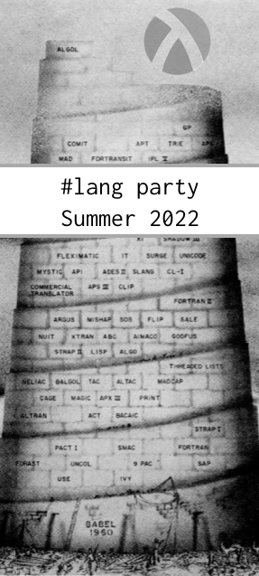

Lang Party Summer 2022
===

  <b>Write a language with Racket this summer! Win prizes!</b>
  
  <a href="https://github.com/lang-party/Summer2022"><tt>https://github.com/lang-party/Summer2022</tt></a>

Topics include but are not limited to: Macros, Static typing, Rhombus,
Rosette-based, Turnstile-based, Internal DSL, External DSL, Block-based,
Non-textual, Targets JavaScript, Targets WebAssembly, Targets LLVM,
Heterogeneous targets Interpreter, Compiler, Joke/funny, Tooling, Language
level, Lsp/langserver support, EMACS support, VIM support, VScode support,
raco tool, custodians, impersonators, will executors, and dye packs.

### Ground Rules

Any language counts as long as you helped to make it. Big or small, brand new
or recently improved.

Submit as many times as you like.

Limit 1 prize per participant. Prizes TBD.

Open until October 1.

Everyone is welcome. Be good. Follow the Racket Friendly Environment Policy:
 <https://racket-lang.org/friendly.html>

### How to Submit

Submissions, rough ideas, and requests for help are all welcome on the
`lang-party/Summer2022` repo issue tracker. Here are two quick start links:

- Ready to submit? Click here:
  <https://github.com/lang-party/Summer2022/issues/new?assignees=&labels=&template=enter-the-lang-party.md&title=%5Bentry+-+name%2Fdescription+of+language%5D>
- Have an idea to share? Click here:
  <https://github.com/lang-party/Summer2022/issues/new?assignees=&labels=lang-request&template=lang-request.md&title=%5BLang+Request%5D+...>

### Fine Print

This is an unofficial event run by Racket users (@spdegabrielle and @bennn)

Submitted languages may use any software license.

For the text in each submission, however, we ask that you license it
as [CC BY 4.0](https://creativecommons.org/licenses/by/4.0/).

### Further Reading

This is a tiny list. Suggestions welcome!

- Beautiful Racket
  <https://beautifulracket.com/>
- Mythical Macros tutorial
  <https://soegaard.github.io/mythical-macros/>
- Macros and Languages in Racket book draft
  <http://rmculpepper.github.io/malr/>
- Racket Guide: Creating Languages
  <https://docs.racket-lang.org/guide/languages.html>
- Racket Docs search for all languages:
  <https://docs.racket-lang.org/search/index.html?q=H%3A>

